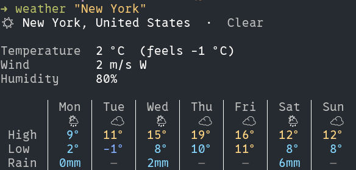
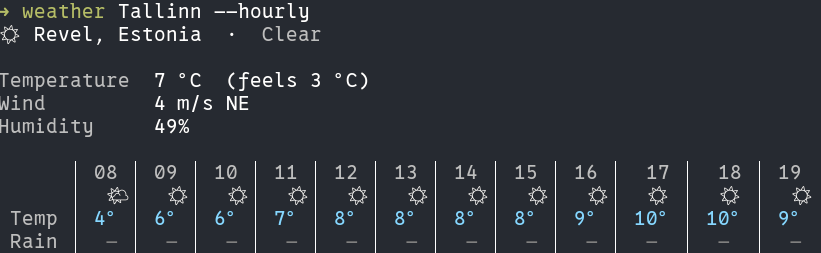
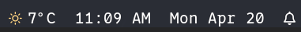

# weather

Tiny Go CLI for current conditions, a 7-day forecast, hourly breakdown, and a tmux statusbar widget. Backed by [Open-Meteo](https://open-meteo.com). No API key.

### Current + 7-day forecast



### Hourly breakdown



## Install

```
curl -sSL https://raw.githubusercontent.com/phcurado/weather/main/install.sh | sh
```

Or: `go install github.com/phcurado/weather/cmd/weather@latest`.

## Usage

```
weather [city]                # summary + 7-day forecast
weather [city] --hourly       # summary + next 12 hours
weather [city] -n 24          # summary + N hours (implies hourly)
weather widget                # tmux status-line line
weather config                # print resolved config + path
```

If `[city]` is omitted, your current location is resolved from your public IP (via [ipwho.is](https://ipwho.is), no API key). The IP lookup is not cached, so the result follows you as you travel. Accuracy is city-level — a VPN or mobile carrier may place you nearby rather than exactly.

If the IP lookup fails (no network, service blocked), `city` from config is used as a fallback.

Multi-word cities need quoting:

```
weather "new york"
weather "são paulo"
```

Ambiguous names resolve to the highest-ranked match from the Open-Meteo geocoder. To bias toward a specific place, append the country by its **full English name**:

```
weather "paris, United States"     # Paris, Texas
weather "valencia, Spain"
```

The geocoder only indexes cities/towns, not states or regions. `"rio grande do sul"` returns nothing — use its capital `"porto alegre"` instead.

Geocoded coordinates are cached permanently in `$XDG_CACHE_HOME/weather/geocode/`, so a once-resolved city stays resolved. Delete the file (or the whole `geocode/` dir) to re-query.

Flags:

- `-H, --hourly` — show hourly view instead of the 7-day table
- `-n, --hours N` — hours to show with hourly view (default 12)

## Configuration

Path: `$XDG_CONFIG_HOME/weather/config.toml` (fallback `~/.config/weather/config.toml`).

```toml
city      = "Tallinn"  # optional fallback when IP geolocation fails
units     = "metric"   # "metric" | "imperial"
cache_ttl = "10m"
```

All fields optional. Defaults: no city fallback, metric, 10m cache TTL.

## tmux

```
set -g status-right '#(command -v weather >/dev/null 2>&1 && weather widget || echo "")  %I:%M %p  %a %b %d'
```



`widget` is designed to fail silently — the segment renders empty if the binary is missing or the network is down. It emits tmux format strings (`#[fg=...]`) so tmux colorizes the glyph natively. Requires a Nerd Font patched terminal font.

## Cache

- `$XDG_CACHE_HOME/weather/geocode/` — permanent
- `$XDG_CACHE_HOME/weather/weather/` — TTL from config
- On API failure with any cache hit (fresh or stale): the cache is used; interactive commands emit a warning on stderr, `widget` stays silent.

## License

MIT.
